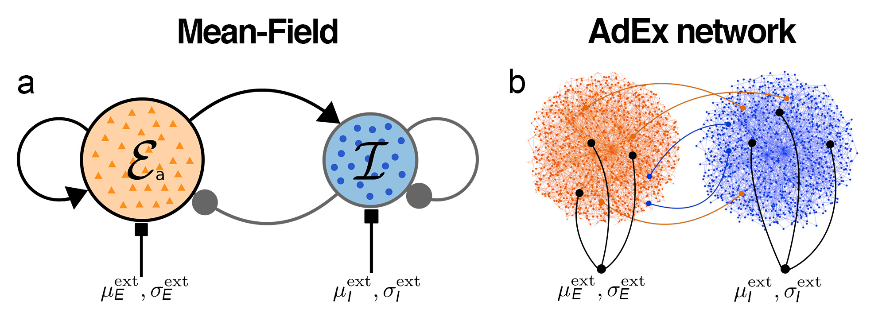

# State-dependent effects of electrical stimulation on populations of excitatory and inhibitory neurons



###Abstract

Electrical stimulation of neural populations is a key tool for understanding neural dynamics and developing treatments. To investigate the effects of external stimulation on a basic cortical motif, we analyse the dynamical properties of an efficient mean-field neural mass model of excitatory and inhibitory adaptive exponential integrate-and-fire (AdEx) neurons and validate the results using detailed network simulations. 
The state space of the mean-field model and of the detailed network are closely related. They reveal asynchronous up and down-states, bistable regions, and oscillatory regions corresponding to fast excitation-inhibition and slow excitation-adaptation feedback loops. 
Within this dynamical landscape, external stimuli can cause state transitions, such as turning on and off oscillations. Oscillatory input can frequency-entrain and phase-lock endogenous oscillations. The effects of external stimulation are well-predicted by the mean-field model, further underpinning the utility of low-dimensional neural mass models. 	

## Getting Started

In this repository, you find the simulation engine for a) a fast and efficient mean-field mneural mass model of a large network of [AdEx neurons](http://www.scholarpedia.org/article/Adaptive_exponential_integrate-and-fire_model) and b) the corresponding network simulation of individual neurons implemented in [Brian2](https://github.com/brian-team/brian2). Furthermore, you will find numerous [Jupyter](https://jupyter.org/) notebooks, that will show you how to run simulations and experiments, save the data, and recreate the figures found in our article.

### Prerequisites

Please install [anaconda](https://www.anaconda.com/distribution/) for python 2.7 on your computer before you clone this repository.

### Installing

To make it easier to run the code in this project and reproduce our findings, we have created an anaconda environment. This helps you to get all the correct versions of the libraries we have used as well as python 2.7. 

The following command creates the anaconda environment on your computer:

```
conda env create -f nip27.yml
```

### Overview of code repository

Path  | Description
:------------- | :-------------
&boxvr;&nbsp; models  | Contains code for simulations.
&boxv;&nbsp; &boxvr;&nbsp; aln  | Mean-field model.
&boxv;&nbsp; &ensp;&ensp; &boxur;&nbsp; aln-precalc  | Precompute quantities for linear-nonlinear cascade (adapted from [Augustin 2017](https://github.com/neuromethods/fokker-planck-based-spike-rate-models)).
&boxv;&nbsp; &boxvr;&nbsp; brian2  | Brian2 network model.
&boxv;&nbsp; &boxur;&nbsp; utils  | Utility functions.
&boxv;&nbsp;&ensp;&ensp; &ensp;&ensp; &boxvr;&nbsp; aEIF_extended.py  | Compute equivalent electric field strengths (Aspart 2016 et al. DOI:10.1371/journal.pcbi.1005206).
&boxv;&nbsp;&ensp;&ensp; &ensp;&ensp; &boxvr;&nbsp; fitparams.py  | Parameters for points of interest.
&boxv;&nbsp;&ensp;&ensp; &ensp;&ensp; &boxvr;&nbsp; functions.py  | Helper function for data analysis.
&boxv;&nbsp;&ensp;&ensp; &ensp;&ensp; &boxvr;&nbsp; paths.py  | Default paths for data storage (**edit this to your needs**).
&boxv;&nbsp;&ensp;&ensp; &ensp;&ensp; &boxvr;&nbsp; pypet_parameters.py  | Helper file for parameter exploration with pypet.
&boxv;&nbsp;&ensp;&ensp; &ensp;&ensp; &boxur;&nbsp; runModels.py  | Wrapper for running models easily.
&boxur;&nbsp; notebooks  | Contains code for reproduction of figures in the article.
&ensp;&ensp; &ensp;&ensp; &boxvr;&nbsp; figure2  | Bifurcation diagrams.
&ensp;&ensp; &ensp;&ensp; &boxvr;&nbsp; figure3  | Stacked bifurcation diagrams with changing adaptation values.
&ensp;&ensp; &ensp;&ensp; &boxvr;&nbsp; figure4  | Example traces for electrical stimulation.
&ensp;&ensp; &ensp;&ensp; &boxvr;&nbsp; figure5  | Frequency entrainment of the population activity by oscillatory. input
&ensp;&ensp; &ensp;&ensp; &boxur;&nbsp; figure6  | Phase locking by oscillatory input.


## Tutorial

Nothing here yet. Please be kindly refered to `notebooks/figure2` for a basic overview on how to load and run the models.

## Built With

* [Brian2](https://github.com/brian-team/brian2) - A clock-driven simulator for spiking neural networks
* [pypet](https://github.com/SmokinCaterpillar/pypet) - Python parameter exploration toolbox
* [numpy](https://github.com/numpy/numpy) - The fundamental package for scientific computing with Python.

## Authors

Caglar Cakan*, Klaus Obermayer
Department of Software Engineering and Theoretical Computer Science, Technische Universität Berlin, Germany
Bernstein Center for Computational Neuroscience Berlin, Germany

*cakan@ni.tu-berlin.de

## License

This project is licensed under the BSD 2 - see the [LICENSE](LICENSE) file for details.

## Acknowledgments

* A model comparison of the mean-field population model can be found [in this repository](https://github.com/neuromethods/fokker-planck-based-spike-rate-models) based on the article by Augustin, Ladenbauer, Baumann, Obermayer, *Low-dimensional spike rate models derived from networks of adaptive integrate-and-fire neurons: comparison and implementation*, PLOS Computational Biology 2017. The code for precomputing the filter components of the linear-nonlinear cascade is based on this project as well.
* Aspart et al. layed out the work for converting the electric current amplitudes into extracellular field strengths in *Extending Integrate-and-Fire Model Neurons to Account for the Effects of Weak Electric Fields and Input Filtering Mediated by the Dendrite.* PLoS Computational Biology, 2016. 